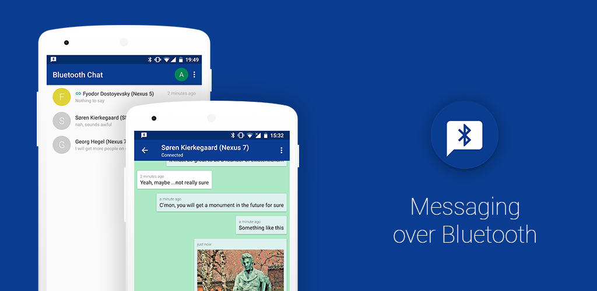

# Bluetooth Chat

1-to-1 chatting app over Bluetooth

This project is a test area for trying and mastering fancy programming stuff: Kotlin, MVP, DI, Coroutines, testing, Architecture Components, the newest Android features.

Localization 
--------
You can help to localize Bluetooth Chat to your language using [Crowdin](https://crowdin.com/project/bluetoothchat)

Third Party Libraries
--------
* [Android-RateThisApp](https://github.com/kobakei/Android-RateThisApp)
* [TextDrawable](https://github.com/amulyakhare/TextDrawable)
* [EasyImage](https://github.com/jkwiecien/EasyImage)
* [PhotoView](https://github.com/chrisbanes/PhotoView)
* [Picasso](https://github.com/square/picasso)
* [Chroma](https://github.com/ItsPriyesh/chroma)
* [Koin](https://github.com/InsertKoinIO/koin)
* [MockK](https://github.com/oleksiyp/mockk)

Donations
--------
Just in case...

BTC: 17Uqe6E1kswkmdkQCjTz5owQruHJwxPPsp

License
--------
    Copyright 2017 - 2018 Vasyl Glodan

    Licensed under the Apache License, Version 2.0 (the "License");
    you may not use this file except in compliance with the License.
    You may obtain a copy of the License at

        http://www.apache.org/licenses/LICENSE-2.0

    Unless required by applicable law or agreed to in writing, software
    distributed under the License is distributed on an "AS IS" BASIS,
    WITHOUT WARRANTIES OR CONDITIONS OF ANY KIND, either express or implied.
    See the License for the specific language governing permissions and
    limitations under the License.
